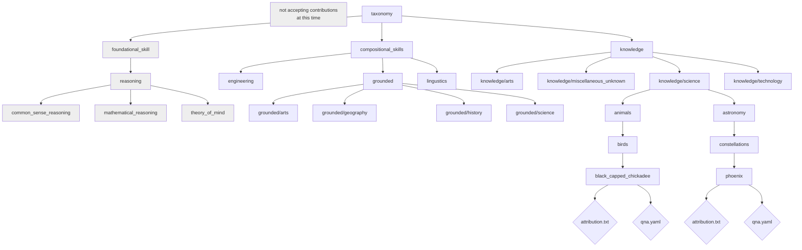

## About taxonomy trees and QnA YAMLs

InstructLab 🐶 uses a novel synthetic data-based alignment tuning method for
Large Language Models (LLMs.) The "**lab**" in Instruct**Lab** 🐶 stands for
[**L**arge-Scale **A**lignment for Chat**B**ots](https://arxiv.org/abs/2403.01081) [1].

The LAB method is driven by taxonomies, which are largely created manually and
with care.

This repository contains a taxonomy tree that allows you to create models
tuned with your data (enhanced via synthetic data generation) using the LAB 🐶
method.

[1] Shivchander Sudalairaj*, Abhishek Bhandwaldar*, Aldo Pareja*, Kai Xu, David D. Cox, Akash Srivastava*. "LAB: Large-Scale Alignment for ChatBots", arXiv preprint arXiv: 2403.01081, 2024. (* denotes equal contributions)

## Intro to skills and knowledge 

Skill and knowledge are the types of data that you can add to the taxonomy tree. You can then use these types to train a model on data it might not already know.

### Knowledge 

Knowledge for an AI model consists of data and facts. When creating knowledge sets for a model, you are providing it with additional data and information so the model can answer questions more accurately. Where skills are the information that trains an AI model on how to do something, knowledge is based on the model’s ability to answer questions that involve facts, data, or references. For example, you can create a data set that includes a product’s documentation and the model can learn the information provided in that documentation.

### Skills 

A skill is a capability domain that intends to train the AI model on submitted information. When you make a skill, you are teaching the model how to do a task. Skills on RHEL AI are split into categories:

* Composition skill: Compositional skills allow AI models to perform specific tasks or functions. There are two types of compositional skills:
** Freeform compositional skills: These are performative skills that do not require additional context or information to function.
** Grounded compositional skills: These are performative skills that require additional context. For example, you can teach the model to read a table, where the additional context is an example of the table layout.
Foundation skills: Foundational skills are skills that involve math, reasoning, and coding.

## InstructLab QnA YAML files 

You can teach LLMs new information by creating a `qna.yaml` file that contains information of your knowledge or details of your skill. 

For more information on creating skills and knowledge YAML files, see:

* [Skills overview](skills/index.md)
* [Knowledge overview](knowledge/index.md)

## Choosing domains for the taxonomy

In general, we use the Dewey Decimal Classification (DDC) System to determine our domains (and subdomains) in the taxonomy. This [DDC SUMMARIES document](https://www.oclc.org/content/dam/oclc/dewey/resources/summaries/deweysummaries.pdf) is a great resource for determining where a topic might be classified.

If you are unsure where to put your knowledge or compositional skill, create a folder in the `miscellaneous_unknown` folder under the `knowledge` or `compositional_skills` folders.

## Taxonomy tree Layout

The taxonomy tree is organized in a cascading directory structure. At the end of
each branch, there is a YAML file (qna.yaml) that contains the examples for that
domain. Maintainers can decide to change the names of the existing branches or to add new branches.

!!! important
    Folder names do not have spaces. Use underscores between words.

## Taxonomy diagram

!!! note
    These diagrams shows a subset of the taxonomy. It is not a complete representation.

