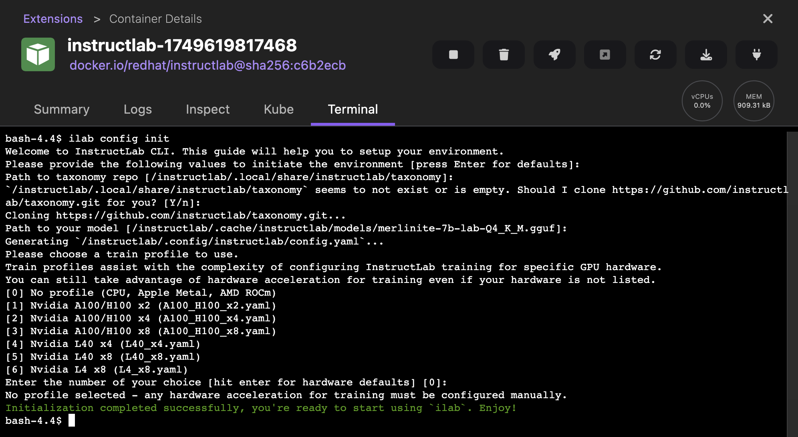
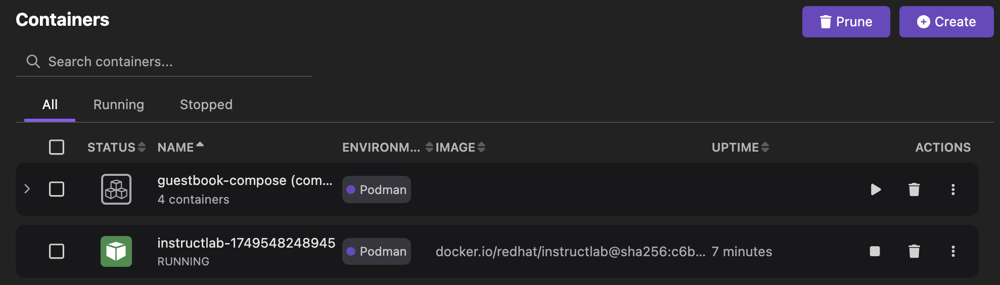

---
title: Start InstructLab as a container
description: Covers the procedure to start an InstructLab container using the Podman Desktop UI
logo: images/ilab_dog.png
---

# Using InstructLab with Podman Desktop

With InstructLab-Podman Desktop integration, you can easily use the Podman Desktop UI to create an InstructLab container to work with. Podman Desktop provides the Podman AI Lab extension to work with Large Language Models (LLMs) in a local development environment. The extension also provides an option to start InstructLab as a container.

With a running InstructLab container, you can initialize an InstructLab session and train models with specialized knowledge and skill tuning. In the container's terminal, configure the InstructLab CLI to run relevant commands to download, serve, and chat with the model. 

#### Prerequisites
Make sure you have:

- [Installed Podman Desktop](https://podman-desktop.io/docs/installation)
- [A running Podman machine](https://podman-desktop.io/docs/podman/creating-a-podman-machine). 
- Installed the [AI Lab extension](https://podman-desktop.io/tutorial/running-an-ai-application#installing-the-extension).

#### Procedure

1. Click **AI Lab** in the left navigation pane.
1. In the TUNING section, click **Try InstructLab**.
1. Click the **Start InstructLab Container** button on the opened page. This step might take some time to start the container.
1. Click the **Open InstructLab container** button to access the container's terminal.

1. Run the `ilab config init` command to configure the InstructLab CLI.
    

#### Verification

1. View the InstructLab container running on the Containers page. 
    
1. Click the name of the container to view its logs. 
1. Click the **Terminal** tab to run `ilab` commands, such as `ilab model download`, `ilab model serve`, and `ilab model chat`.
