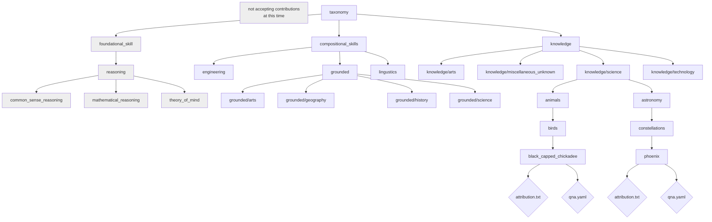

## Welcome to the InstructLab Taxonomy

InstructLab 🐶 uses a novel synthetic data-based alignment tuning method for
Large Language Models (LLMs.) The "**lab**" in Instruct**Lab** 🐶 stands for
[**L**arge-Scale **A**lignment for Chat**B**ots](https://arxiv.org/abs/2403.01081) [1].

The LAB method is driven by taxonomies, which are largely created manually and
with care.

This repository contains a taxonomy tree that allows you to create models
tuned with your data (enhanced via synthetic data generation) using the LAB 🐶
method.

[1] Shivchander Sudalairaj*, Abhishek Bhandwaldar*, Aldo Pareja*, Kai Xu, David D. Cox, Akash Srivastava*. "LAB: Large-Scale Alignment for ChatBots", arXiv preprint arXiv: 2403.01081, 2024. (* denotes equal contributions)

## Choosing domains for the taxonomy

In general, we use the Dewey Decimal Classification (DDC) System to determine our domains (and subdomains) in the taxonomy. This [DDC SUMMARIES document](https://www.oclc.org/content/dam/oclc/dewey/resources/summaries/deweysummaries.pdf) is a great resource for determining where a topic might be classified.

If you are unsure where to put your knowledge or compositional skill, create a folder in the `miscellaneous_unknown` folder under the `knowledge` or `compositional_skills` folders.

## Learning

Learn about the concepts of "skills" and "knowledge" in our [InstructLab Community Learning Guide](https://github.com/instructlab/community/blob/main/docs/README.md).

## Taxonomy tree Layout

The taxonomy tree is organized in a cascading directory structure. At the end of
each branch, there is a YAML file (qna.yaml) that contains the examples for that
domain. Maintainers can decide to change the names of the existing branches or to add new branches.

!!! important
    Folder names do not have spaces. Use underscores between words.

## Taxonomy diagram

!!! note
    These diagrams shows a subset of the taxonomy. It is not a complete representation.



Below is an illustrative directory structure to show this layout:

```ascii
.
└── linguistics
    ├── writing
    │   ├── brainstorming
    │   │   ├── idea_generation
    |   │       └── qna.yaml
    │   │           attribution.txt
    │   │   ├── refute_claim
    |   │       └── qna.yaml
    │   │           attribution.txt
    │   ├── prose
    │   │   ├── articles
    │   │       └── qna.yaml
    │   │           attribution.txt
    └── grammar
        └── qna.yaml
        │   attribution.txt
        └── spelling
            └── qna.yaml
                attribution.txt
```
## Contribute knowledge and skills to the taxonomy

The ability to contribute to a Large Language Model (LLM) has been difficult in no small part because it is difficult to get access to the necessary compute infrastructure.

This taxonomy repository will be used as the seed to synthesize the training data for InstructLab-trained models. We intend to retrain the model(s) using the main branch following InstructLab's progressive training on a regular basis. This enables fast iteration of the model(s), for the benefit of the open source community.

By contributing your skills and knowledge to this repository, you will see your changes built into an LLM within days of your contribution rather than months or years! If you are working with a model and notice its knowledge or ability lacking, you can correct it by contributing knowledge or skills and check if it's improved after your changes are built.

While public contributions are welcome to help drive community progress, you can also fork this repository under [the Apache License, Version 2.0](../LICENSE), add your own internal skills, and train your own models internally. However, you might need your own access to significant compute infrastructure to perform sufficient retraining.

## Ways to Contribute

You can contribute to the taxonomy in the following two ways:

1. Adding new examples to **existing leaf nodes**:
2. Adding **new branches/skills** corresponding to the existing domain:

For more information, see the [Ways of contributing to the taxonomy repository](https://github.com/instructlab/taxonomy/blob/main/CONTRIBUTING.md#ways-of-contributing-to-the-taxonomy-repository) documentation.

## How to contribute skills and knowledge

To contribute to this repo, you'll use the *Fork and Pull* model common in many open source repositories. You can add your skills and knowledge to the taxonomy in multiple ways; for additional information on how to make a contribution, see the [Documentation on contributing](../community/CONTRIBUTING.md). You can also use the following guides to help with contributing:

- Contributing using the [GitHub webpage UI](https://github.com/instructlab/taxonomy/blob/main/docs/contributing_via_GH_UI.md).
- Contributing knowledge to the taxonomy in the [Knowledge contribution guidelines](../taxonomy/knowledge/guide.md).

### Why should I contribute?

This taxonomy repository will be used as the seed to synthesize the training
data for InstructLab-trained models. We intend to retrain the model(s) using the main
branch as often as possible (at least weekly).
Fast iteration of the model(s) benefits the open source community and enables model developers who do not have access to the necessary compute infrastructure.
