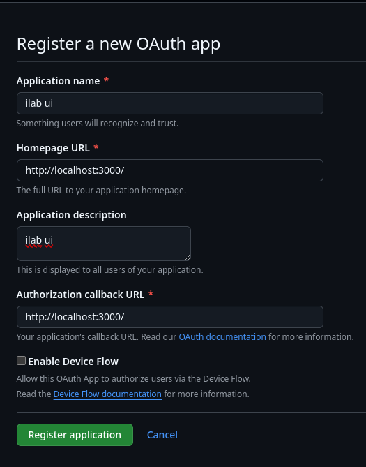

This chapter is dedicated to the settings for running the User Interface locally.

## .env

```bash
IL_UI_ADMIN_USERNAME=admin
IL_UI_ADMIN_PASSWORD=password
IL_UI_DEPLOYMENT=dev

OAUTH_GITHUB_ID=<OAUTH_APP_ID>
OAUTH_GITHUB_SECRET=<OAUTH_APP_SECRET>

NEXTAUTH_SECRET=your_super_secret_random_string
NEXTAUTH_URL=http://localhost:3000

IL_GRANITE_API=<GRANITE_HOST>
IL_GRANITE_MODEL_NAME=<GRANITE_MODEL_NAME>
IL_MERLINITE_API=<MERLINITE_HOST>
IL_MERLINITE_MODEL_NAME=<MERLINITE_MODEL_NAME>

GITHUB_TOKEN=<TOKEN FOR OAUTH INSTRUCTLAB MEMBER LOOKUP>
TAXONOMY_DOCUMENTS_REPO=github.com/instructlab-public/taxonomy-knowledge-docs
NEXT_PUBLIC_AUTHENTICATION_ORG=<AUTHENTICATION_ORG>
NEXT_PUBLIC_TAXONOMY_REPO_OWNER=<GITHUB_ACCOUNT>
NEXT_PUBLIC_TAXONOMY_REPO=<REPO_NAME>
```

## OAuth 

To set up the github OAuth settings for the UI, please refer to the steps below

`Github settings` -> `Developer settings` -> `OAuth Apps` -> `Create New OAuth App` 

Fill in the fields as shown below:



Set the `Homepage URL` and the `Authorization Callback URL` to `http://localhost:3000`.

Once the app is created, there will be an option to create a secret. Press the Create Secret button and it will generate a secret for you.

Update the .env files with the new ID and secret ID generated, `OAUTH_GITHUB_ID` = Client ID, `OAUTH_GITHUB_SECRET` = Client Secret

!!! note 
    If you prefer to not set up the OAuth, we recommend for you to reach out to the UI Maintainers in our `#ui` [slack channel](https://join.slack.com/t/instruct-lab/shared_invite/zt-2kieyqiz9-zhXSxGnXk6uL_f3hVbD53g) , where they will provide details for setting up an OAuth app for the instructlab-public org.