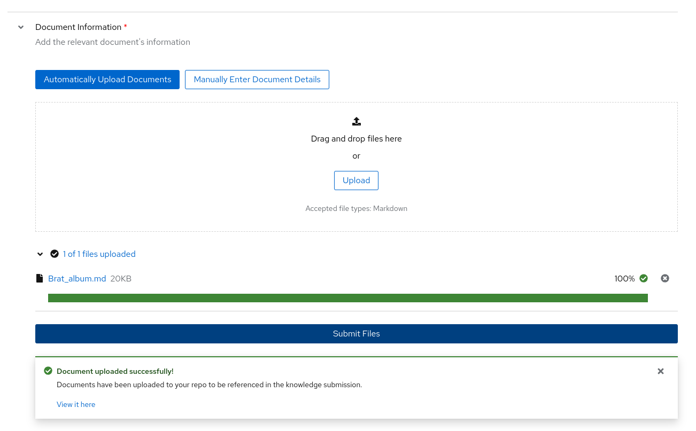
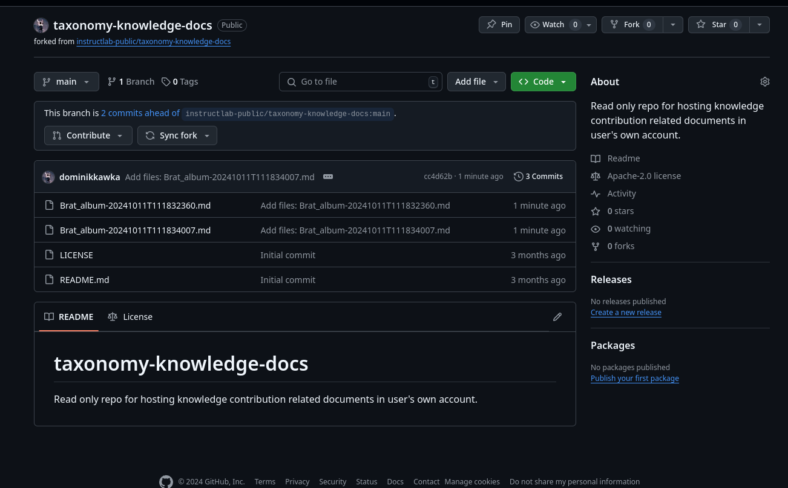
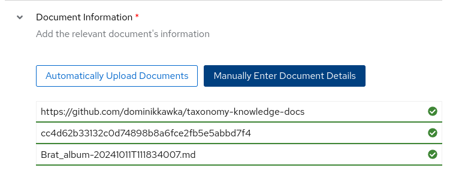

The UI Simplifies the process for Skills & Knowledge contributions by:

* Minimising risk of human error when writing YAML by using the web form. 

* Directly submit a GitHub pull request with a press of a button.

When the form is filled out, you also are given the option to download the YAML and attribution files to your local machine, and to view the form in its original YAML structure before submission.

You can view all your submissions on the dashboard page.

!!! warning
    Even when running the UI locally, you must be logged in via github to successfully submit your Knowledge and Skills contributions. You can still fill out the form, and download the YAML and attribution files.

For tips on writing Skills & Knowledge contributions, please visit the documentation under the [Taxonomy](../taxonomy/index.md) heading.

## Knowledge Contributions

Firstly you will need to find a source document for your knowledge. Accepted sources can be found [here](../taxonomy/knowledge/guide.md).

Navigate to the Contribute section of the sidebar and click Knowledge. Here you will see the form to contribute Knowledge to the open-source taxonomy tree.

### Author Information

Use your GitHub account email address and full name here. This will make sure that this contribution and the data with it is properly signed off and credited to you.

### Knowledge Information

In the box for the submission summary, give a brief description of what your knowledge is. This will be used in the PR description after you submit. Below that you will fill in the domain the knowledge you are adding would fall under. For example, if you want to teach the model the winners at the 2024 Olympics, you might put "Olympic history" as the domain.

!!! note 
    The task domain is a critical part of the SDG process and will be part of the prompt when generating synthetic data. Ask your self: "What kind of textbook would contain the knowledge I am trying to teach the model?"

The final box in Knowledge Information will contain an outline of the document.

### Taxonomy Directory Path

Using the dropdown menu, you will be able to select where you think your knowledge will fit the best in the taxonomy tree.

!!! note 
    Proper placement within the taxonomy tree will allow other users to more accurately locate existing leaf nodes. Ask yourself: "What section of the library would I expect to find my skill under?"

### Seed Examples

Here you will begin filling out your QNA examples that represent the knowledge you are trying to teach. There must be exactly 5 seed examples in this section. Each seed example needs one unique piece of context from your source document with no more than 500 characters. From this piece of context, you will need to create 3 QNA pairs that can be answered from the context you have selected.

### Document Information

You must prepare a markdown file version of the document you wish to use for the knowledge submission. By dragging and dropping the markdown file into the box, and clicking the submit files button, a forked version of the taxonomy repository will be automatically created on your GitHub profile. 

If you've already uploaded the markdown file to your GitHub, you can switch to manually adding the document, and entering the `commit sha`.

!!! note 
    Your knowledge document must be place in a public GitHub repo in order to be accepted. When your submission is being reviewed and merged, this document will need to be accessible publicly.

### Attribution Information

Linking the source you used for information. Wikipedia articles change overtime, make sure to add the oid from the wikipedia article, which you can find by clicking on `View history`, and select the relevant version. 

The license for Wikipedia articles will be "CC-BY-SA-4.0" and Creator Name can simply be "Wikipedia Authors"

## Dashboard

Once you have submitted a Skills or Knowledge Contribution, you can view it on your dashboard, and edit the submission via the UI if needed.

[Next Steps](skills_contributions.md){: .md-button .md-button--primary }