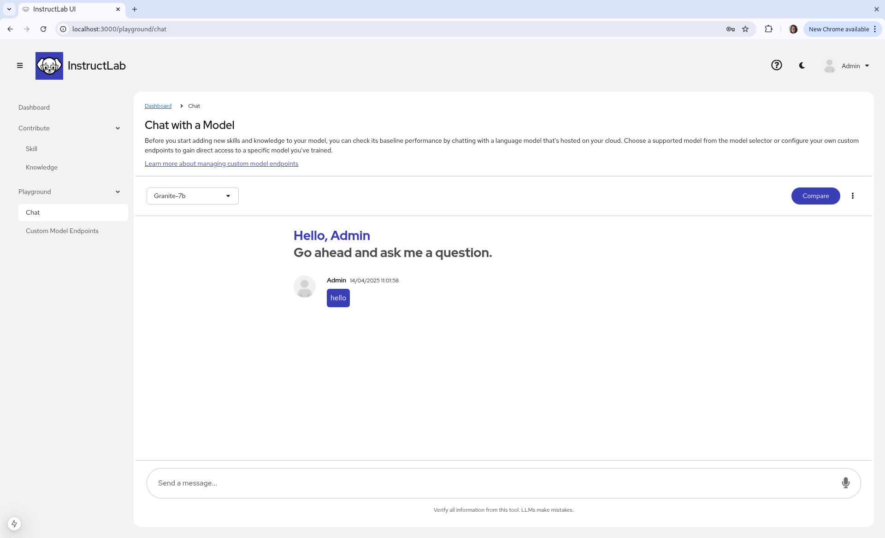
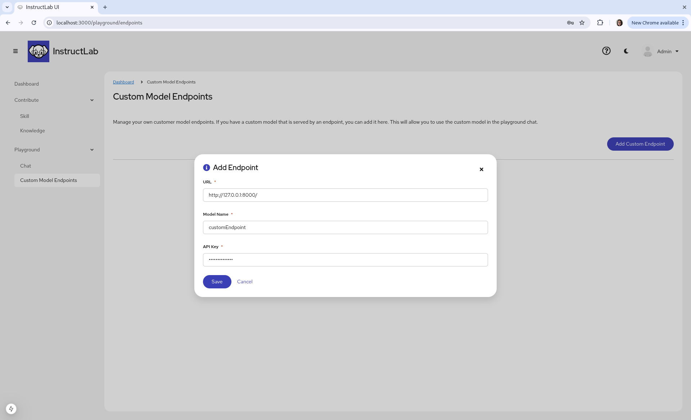
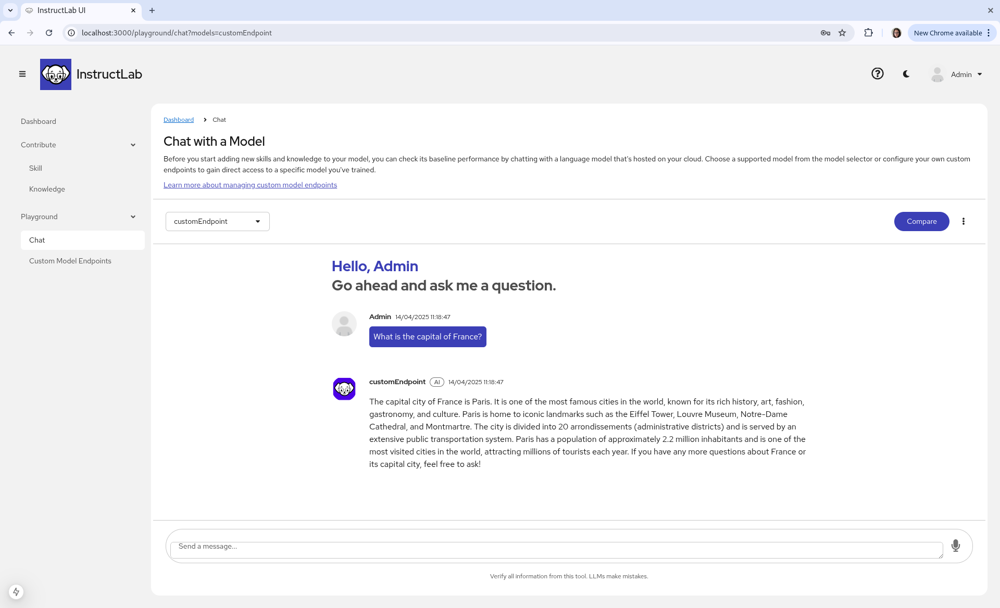

To run with a locally run model, make sure that iLab model serve is running in a separate terminal. If you are unsure on how to do this, please visit the [Intro to serve and chat](../getting-started/serve_and_chat.md) section of this document.

If you go to `Playground > Chat` by using the side navigation bar, you can interact with the Merlinite and Granite models. 

If you are running the ui within a dev environment, the model won't reply because a Granite/Merinite model endpoint hasn't been given. In this case, we will create a new custom model endpoint, using our locally hosted quantised model.

To add a custom model endpoint, go to `Playground > Custom Model Endpoints` and press the `Add Endpoint` button on the right side. 

You will have 3 fields to fill out:

* The URL, where your customised model is hosted, if hosting locally, the URL would be `http://127.0.0.1:8000/`

* The Model Name, `merlinite-7b-lab-Q4_K_M.gguf`

* API Key, you may put any text in here; in this case I've used `randomCharacters`. If you are setting up an API key, please provide the key in this section.

Go back to the playground chat, select newly added model and chat.

[Next Steps](knowledge_contributions.md){: .md-button .md-button--primary }
