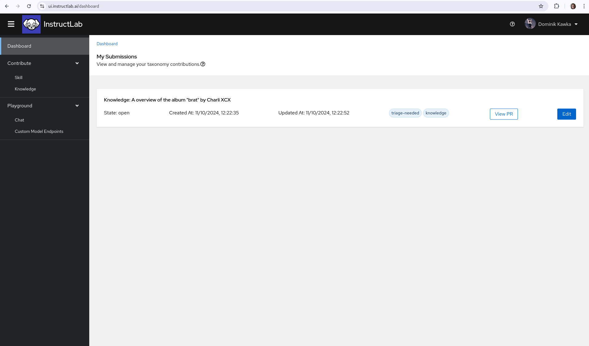

The UI Simplifies the process for Skills & Knowledge contributions by:

* Minimising risk of human error when writing YAML by using the web form. 

* Directly submit a github pull request with a press of a button.

When the form is filled out, you also are given the option to download the YAML and attribution files to your local machine, and to view the form in its original YAML structure before submission.

You can view all your submissions on the dashboard page.

!!! warning
    Even when running the UI locally, you must be logged in via github to successfully submit your Knowledge and Skills contributions. You can still fill out the form, and download the YAML and attribution files.

For tips on writing Skills & Knowledge contributions, please visit the documentation under the [Taxonomy](/taxonomy/) heading.

## Skill Contributions

If you have found a missing skill in granite chat, you can create a skill contribution easily through the UI. Remember, a guide to help you learn about what a Skill is can be found in the InstructLab Github

Navigate to the Contribute section of the sidebar and click Skill. Here you will see the form to contribute a Skill to the open-source taxonomy tree.

On this page you will find all the necessary pieces to fill in to create you Skill contribution, let's go through each one [here](/taxonomy/skills/skills_guide)

### Author Information

Use your GitHub account email address and full name here. This will make sure that this contribution and the data with it is properly signed off and credited to you.

### Skill Information

In the box for the submission summary, give a brief description of what your skill is. This will be used in the PR description after you submit. Below that you will fill in a detailed description of what your skill is teaching the model to do. For example, if your skill is extracting the date from a bean count ledger, you would fill in "Teaching the model to extract the date from a bean count ledger"

!!! note The detailed description is very important for quality synthetic data generation. What you fill in for this box will be used as prompting during the SDG process. Imagine you are telling the teacher model: "The task is (your description here)"

### Taxonomy Directory Path

Using the dropdown menu, you will be able to select where you think your skill will fit the best in the taxonomy tree. If your skill is a grounded skill (meaning that it requires context to answer) you will need to navigate into the "grounded" section of the taxonomy tree before selecting the proper subsection. Otherwise, select the section you think best represents the subject of your skill.

!!! note Proper placement within the taxonomy tree will allow other users to more accurately locate existing leaf nodes. Ask yourself: "What section of the library would I expect to find my skill under?"

### Seed Examples

Here you will begin filling out your QNA examples that represent the skill you are trying to teach. You will need a minimum of 5 seed examples, which each example consisting of a Question and Answer. If your skill is a grounded skill and requires context, you will also add context for each QNA pair here.

!!! note The QNA pairs that you create here should be diverse. You should try to rephrase questions in different ways and create unique contexts. For example, in the case of date extraction from bean count, you do not want to use the same date repeatedly in your seed examples, as this may have the unintended consequence of teaching the model to simply regurgitate the same date when asked any date extraction question.

### Attribution

The information filled in this section will create the attribution.txt file needed for your submission. Fill in a concise title for your skill. If your skill is entirely self created, you can put your name as the creator and use Apache-2.0 as the license. Otherwise please refer to your source material for creator and licensing information.

Once you have filled in all the necessary information, you can finally submit your skill! If you would like to download or view the qna.yaml or attribution.txt, there are drop down menus provided for both. If you choose to, you can download these files to create a PR in the taxonomy repository yourself. Otherwise, you can press submit and the UI will automatically create a PR under your GitHub namespace in the InstructLab Taxonomy repository.

## Dashboard

Once you have submitted a Skills or Knowledge Contribution, you can view it on your dashboard, and edit the submission via the UI if needed.

[Next Steps](/user-interface/env_oauth_config/){: .md-button .md-button--primary }
