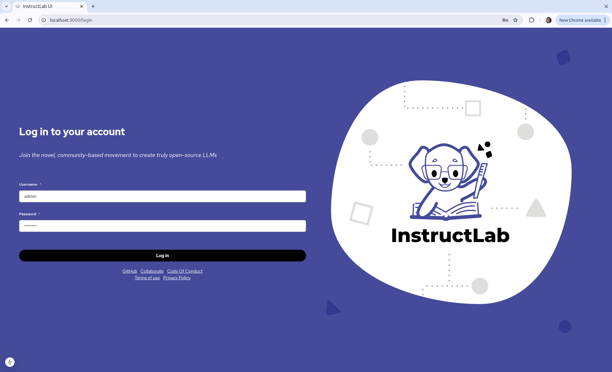

The InstructLab User Interface (UI) is an additional component in the InstructLab project to make Knowledge/Skills 
contributions more accessible to the general user. Instead of having to edit a `qna.yaml` file,
users can fill out the contribution forms on the web. The user can also view all of their contributions in a
centralised list. You can also chat with the models directly on the playground.

There are 2 ways to access the UI:

1. Visit the website at [ui.instructlab.ai](https://ui.instructlab.ai/).

2. Install and run the UI locally.


!!! note
    To log into the UI and submit Knowledge and Skills contributions, you must be a member of the [instructlab-public](https://github.com/instructlab-public) GitHub repository. You will receive an invitation when signing in with github.

!!! note
    If you wish to view the newest features and updates in the user interface, we have a QA environment at [qa.ui.instructlab.ai](https://qa.ui.instructlab.ai).

    Please note that this environment may contain experimental updates and is subject to frequent changes.

## Installation Guide

=== "Podman"

    ## Prerequisites 

    To run the UI locally `ilab-ui-native-installer.sh`, `podman` and `InstructLab` needs to be downloaded:

    **ilab-ui-native-installer.sh**

    ```bash
    mkdir ui-local
    cd ui-local
    curl -o ilab-ui-native-installer.sh -fsSL https://raw.githubusercontent.com/instructlab/ui/refs/heads/main/installers/podman/ilab-ui-native-installer.sh
    chmod a+x ilab-ui-native-installer.sh
    ```

    **Podman Installation**

    === "macOS"

        ```bash
        brew install podman
        podman machine init
        podman machine start
        ```

    === "Linux (Fedora)"

        ```bash
        sudo dnf install podman
        podman machine init
        podman machine start
        ```

    For Instructlab installation and initalization run:

    ```bash
    python3.11 -m venv venv
    source ./venv/bin/activate
    pip install instructlab
    ilab config init --non-interactive
    ```

    ## Starting the UI

    Once the ilab is set up, run ilab-ui-native-installer.sh with the username and password of your preference to start the UI up.

    ```bash
    ./ilab-ui-native-installer.sh install --username admin --password passw0rd! --deploy main
    ```

    UI Installer does the following:

    * Check if InstructLab is set up on the host.
    * Extract the taxonomy repository directory path from the InstructLab configuration file
    * Download and install the ilab-apiserver binary. It allows the UI to communicate actions to InstructLab and retrieve the results of the commands.
    * Generates the secret.yaml file to fill in all the user-provided information and the discovered information securely.
    * Download the InstructLab deployment YAML and update the YAML with the required parameters.
    * Deploy the secrets and the deployment YAML on the Podman, to set up the UI.
    * Once the installation is successfully completed, you can log in to the UI at `http://localhost:3000` with the username and password provided to the installer.

    

    ## Stopping the UI

    To stop the UI, the uninstall command can be used with the ilab-ui-native-installer.sh script.

    ```bash
    ./ilab-ui-native-installer.sh uninstall
    Are you sure you want to uninstall the InstructLab UI stack? (yes/no): yes
    ```

    ## Troubleshooting

    If pod startup times out with:

    ```bash
    Error: playing YAML file: encountered while bringing up pod pathservice-pod: initializing source docker://quay.io/instructlab-ui/pathservice:latest: pinging container registry quay.io: Get "https://quay.io/v2/": dial tcp: lookup quay.io: no such host
    ```

    If Docker compatibility mode is enabled, try disabling it.

=== "Local"

    ## Prerequisites

    Before you can run the User Interface locally, you first must: 

    - Have a [GitHub](https://github.com/) account  
    - Have Node.js installed

    **1. Download the InstructLab UI**

    Run the following command in your desired directory:

    ```bash
    git clone https://github.com/instructlab/ui
    ```

    Or download it directly from the [InstructLab UI GitHub page](https://github.com/instructlab/ui).

    **2. Set up the `.env` file**

    Go into the UI folder:

    ```bash
    cd ui
    ```

    Inside the folder, create a file named `.env` and paste the following content:

    ```env
    IL_UI_ADMIN_USERNAME=admin
    IL_UI_ADMIN_PASSWORD=password
    IL_UI_DEPLOYMENT=native

    OAUTH_GITHUB_ID=<OAUTH_APP_ID>
    OAUTH_GITHUB_SECRET=<OAUTH_APP_SECRET>

    NEXTAUTH_SECRET=your_super_secret_random_string
    NEXTAUTH_URL=http://localhost:3000

    IL_GRANITE_API=<GRANITE_HOST>
    IL_GRANITE_MODEL_NAME=<GRANITE_MODEL_NAME>
    IL_MERLINITE_API=<MERLINITE_HOST>
    IL_MERLINITE_MODEL_NAME=<MERLINITE_MODEL_NAME>

    GITHUB_TOKEN=<TOKEN FOR OAUTH INSTRUCTLAB MEMBER LOOKUP>
    TAXONOMY_DOCUMENTS_REPO=github.com/instructlab-public/taxonomy-knowledge-docs
    NEXT_PUBLIC_AUTHENTICATION_ORG=<AUTHENTICATION_ORG>
    NEXT_PUBLIC_TAXONOMY_REPO_OWNER=<GITHUB_ACCOUNT>
    NEXT_PUBLIC_TAXONOMY_REPO=<REPO_NAME>
    ```

    For now, we only care about `IL_UI_ADMIN_USERNAME`, `IL_UI_ADMIN_PASSWORD`, and `IL_UI_DEPLOYMENT`.  
    You’ll use the `.env` again later in this guide.

    _Save and close the file._

    **3. Install dependencies and run the UI**

    Run this to install the needed files:

    ```bash
    npm install
    ```

    !!! note
        This may take a few minutes depending on your internet speed.

    Then, start the UI with:

    ```bash
    make start-dev-local
    ```

    The UI will be accessible at [localhost:3000](http://localhost:3000).

    

    To stop the UI:

    ```bash
    make stop-dev-local
    ```

    **4. Logging in**

    For now, we will log in by entering admin and password in the username and password fields respectively. You can change the username and password by editing the IL_UI_ADMIN_USERNAME and IL_UI_ADMIN_PASSWORD values in the .env file.

    We are not able to log in with GitHub right now since we haven't set up the GitHub token in the .env file. When logged in, you may see a popup saying that the UI is fetching your submissions, exit out of this notification. If you wish to set up the OAuth, visit the .env and OAuth config page.

    
[Next Steps](playground_chat.md){ .md-button .md-button--primary }
